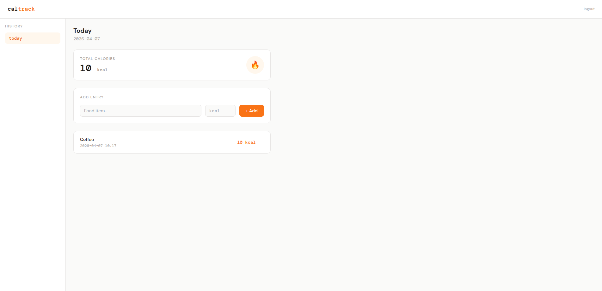

# Calorie Calculator

This project is a simple web-based calorie calculator application built using Python. It allows users to log in, view their dashboard, and calculate their calorie intake.

## Features
- User authentication (login page)
- Dashboard to display calorie-related data
- Base template for consistent UI design

## File Structure
```
app.py               # Main application file
database.py          # Handles database interactions
requirements.txt     # Python dependencies
templates/           # HTML templates for the application
  base.html          # Base template for consistent layout
  dashboard.html     # Dashboard page
  login.html         # Login page
```

## Setup Instructions
1. Clone the repository:
   ```bash
   git clone <repository-url>
   ```

2. Navigate to the project directory:
   ```bash
   cd 03_calorie_calulator
   ```

3. Install the required dependencies:
   ```bash
   pip install -r requirements.txt
   ```

4. Run the application:
   ```bash
   python app.py
   ```

5. Open your browser and navigate to `http://127.0.0.1:5000`.

## Assets


## License
This project is licensed under the MIT License. Feel free to use and modify it as needed.